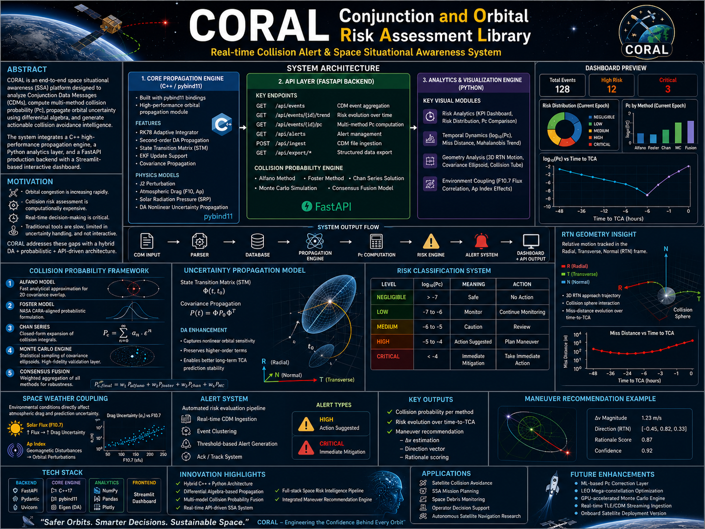

## Preview 

## Preview 

## Preview 

---
# CORAL: Conjunction and Orbital Risk Assessment Library


[](https://fastapi.tiangolo.com)
[](https://isocpp.org/)
[](https://www.python.org/)
[](https://plotly.com/)

CORAL is an industrial-grade space safety platform engineered to process Conjunction Data Messages (CDMs), perform non-linear uncertainty propagation, and manage close-approach warning logs for active satellite missions.

The platform combines a high-speed orbital mechanics engine written in **C++17 Differential Algebra (DA)** with a modern **FastAPI REST Server** and structured SQLite persistence.

---

## 🚀 Core Features

* **High-Accuracy Propagation:** Integrates an adaptive step-size Runge-Kutta 7(8) Dormand-Prince (`RK78`) solver with a PI step controller.
* **Non-Linear Covariance Mapping:** Uses Order-1 (Jacobian) and Order-2 (Hessian / State Transition Tensors) Differential Algebra to map complex non-linear uncertainty structures over time.
* **Robust State Ingestion:** Features an Extended Kalman Filter (EKF) update implemented in the **Joseph Stabilized Form** to prevent matrix asymmetry due to numerical rounding.
* **Multi-Method Risk Valuation:** Computes automated collision probabilities ($P_c$) via Alfano, Foster, Chan, and advanced Monte Carlo models.
* **Interactive Visualization Engine:** Generates interactive Plotly charts tracking $P_c$ time-series curves, risk profiles, and 2D target altitude comparisons.
* **Mission Maneuver Advice:** Automatically checks safety thresholds to provide active $\Delta V$ magnitude, direction, and justification recommendations.

---

## 🗂️ System Architecture

```⚙️
  [ Raw CDM Data (.csv) ]
             │
             ▼
     ┌───────────────┐
     │  FastAPI App  │ ◄─────────── [ Interactive Dashboard ]
     └───────┬───────┘                    (Plotly Renderings)
             │
             ▼
     ┌───────────────┐
     │ SQLite (WAL)  │
     └───────┬───────┘
             │
             ▼
   ┌────────────────────────────────────────────────────────┐
   │             Python Interface Wrapper                   │
   │               (casas_propagator.py)                    │
   └──────────────────────────┬─────────────────────────────┘
                              │ (Attempts native load)
                              ▼
           ┌────────────────────────────────────┐
           │     pybind11 Compiled Extension     │
           │            (casas_cpp)             │
           ├────────────────────────────────────┤
           │  • RK78 Integrator                 │
           │  • Order 1/2 Differential Algebra  │
           │  • Joseph Form EKF Update          │
           └────────────────────────────────────┘

🛠️ Project Structure & Missing Assets
If you are running the full enterprise dashboard system, verify that your local workspace includes these core components:

Code snippet
├── api_server.py           # FastAPI server routing, payload checks & initialization
├── CDM_database.py         # SQLite persistence engine with WAL support
├── Analytics_vis.py        # Plotly data transformation & rendering routines
├── casas_propagator.py     # Fallback layer managing native bindings
├── casas_da.hpp            # C++ Core math, DA types, and integrator structures
├── bindings.cpp            # Pybind11 registration declarations
├── build.sh                # Automation compiler script for POSIX target environments
├── requirements.txt        # Third-party dependency definitions
│
▼ REQUIRED FUNCTIONAL FILES (Verify these are present before starting):
├── CDM_parser.py           # Interprets raw CSV streams into object definitions
├── Collision_Probability.py# Holds numerical risk assessment algorithms
├── Risk_Trend.py           # Manages alert verification and event analysis
└── GMAT_interface.py       # Exports orbital state arrays into NASA GMAT scripts
**
⚙️ Compilation & Environment Setup
1. Prerequisites
Ensure you have a C++17 compatible compiler installed (g++ or clang), alongside development headers for Python.**

**2. Install Dependencies**
pip install -r requirements.txt

**3. Compile the C++ Engine Backend
Execute the automated build script to construct and link the native binary extension:**

Bash
bash build.sh

**Note: This generates a compiled shared module file inside your root folder, allowing transparent performance improvements directly inside your Python runtime**.

**🖥️ Running the Application
To launch the backend API server locally, execute the server wrapper:**

Bash
python api_server.py

**By default, the system boots a worker instance accessible at http://127.0.0.1:8000. You can explore and test the interactive API endpoints directly through the automated Swagger documentation portal at /docs.**

Route,Method,Description
/,GET,HTML system dashboard landing view
/health,GET,System health check alongside record statistics
/api/events,GET,Fetches an aggregated list of close-approach events
/api/events/{id},GET,Retrieves historic updates for a specific conjunction
/api/events/{id}/trend,GET,Time-series risk evolution track
/api/events/{id}/pc,GET,Multi-method risk calculations & maneuver advice
/api/events/{id}/gmat,GET,Downloads an automated NASA GMAT script
/api/ingest,POST,Ingests a new CDM dataset into the database
/api/alerts,GET,Queries active system warning items
/api/alerts/{id}/ack,POST,Sets a warning message status to acknowledged


